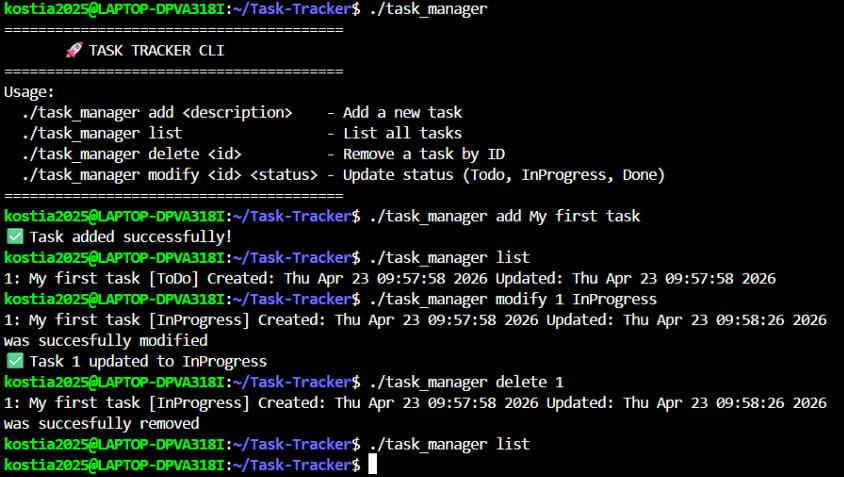

# 🚀 C++ Task Tracker CLI

A high-performance command-line tool for managing workflows. Built with **C++17**, featuring **JSON persistence** and a logic-driven interface.

---

## 🖥️ Usage Demo
The application automatically displays a help menu to guide the user:



### Quick Commands:
```bash
./task_manager add "Finish Project"  # Add task
./task_manager list                 # View all tasks
./task_manager modify 1 Done        # Update status
./task_manager delete 1             # Remove task
```
## ✨ Key Features
Data Persistence: Uses nlohmann/json to ensure tasks survive between sessions.

Smart Tracking: Logs Created and Updated timestamps for every entry.

Robust Logic: Full input validation to prevent runtime crashes.

Clean Architecture: Modular C++ design using Task and TaskManager classes.

## 🧠 Engineering Takeaways
OOP Mastery: Managed complex states (Todo/InProgress/Done) using class methods.

File I/O: Expertly handled structured data parsing and saving in C++.

UX Focus: Designed an intuitive CLI with immediate user feedback and error guidance.

## 🧪 Setup
Bash
# Clone & Compile
```
git clone [https://github.com/Kostia20034/Task-Tracker.git](https://github.com/Kostia20034/Task-Tracker.git)
cd Task-Tracker
g++ -o task_manager main.cpp task.cpp task_manager.cpp
```
# Run
./task_manager
